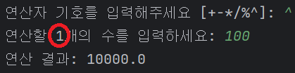

# 계산기 과제 소개
커맨드 라인 상에서 연산자, 숫자들을 입력해 작동하는 계산기를 구현하는 프로젝트입니다.

## 커밋 컨벤션
아래와 같은 형식을 따라 커밋하세요.

<b><타입>: <제목>

<본문>

<꼬리말><b>

### 1. 커밋 타입
- 🆕: 새 기능 추가
- 🔧: 기능 수정 & 개선
- 🐛: 버그 수정
- 📝: 문서 수정
- 🎨: 코드 스타일 변경(들여쓰기 등)
- 🏭: 코드 리팩토링(기능 변경 없이 구조만 개선한 경우)
- 📁: 파일 구조 변경

### 2. 제목
이 커밋에 대한 간략한 설명

예) Main 클래스 리팩토링

### 3. 본문(선택 사항)
이 커밋에 대한 추가 설명

### 4. 푸터(선택 사항)
기타 참고사항 기술 

## 구현한 기능들

### Lv.3 구현 기능

#### 1. Enum 도입
사칙연산 및 Number 타입에 대한 formatter 들을 Enum 으로 정의하였습니다.

미리 정의된 연산 기호들 목록들을 문자열 형식으로 확인할 수 있도록 구현하혔습니다.

of(char c)를 통해 알맞은 연산 객체를 받아와 그에 맞는 연산을 수행하도록 구현하였습니다.

또한 사용자의 연산자 입력 검증에도 사용되도록 하였습니다.

#### 2. 실수 계산 구현
0과 양의 정수 뿐 아니라 실수까지 연산 가능하도록 구현하였습니다.

기존에 수를 검증하던 정규식 대신 각 Number 타입별 converter 와 이들이 던지는 IllegalArgumentException 을 활용하였습니다.

Long, Double 등 사용할 Number 타입이 지정된 Parser 가 단순히 switch 문으로 타입별 변환을 수행하는 것이 아니라,
변환할 수 있는 타입들이 미리 지정된 NumberConverter 에 입력과 자신의 타입을 전달해 해당 타입에 맞는 수를 받을 수 있도록 하였습니다.
코드의 확장성 등을 고려해 Enum 을 도입하였습니다.

이렇게 변환된 수들을 모두 받을 수 있도록 Calculator, OperationTypes 에도 제네릭 타입을 도입하였습니다.

#### 3. 연산 결과와 입력값 비교 기능
연산 이후 연산 결과들에 대해 추가로 수를 입력하면 해당 수보다 큰 결과들을 출력하도록 구현하였습니다.
추가로 입력되는 수 또한 위에서 설명한 검증을 거친 후 Stream, 람다식을 통해 각 연산 결과들과 비교되도록 하였습니다,

### Lv.3까지의 기능들에서 추가로 구현한 기능

#### 1. 질문에 대한 답변 구별 기능
"삭제하시겠습니까?" 란 질문에 단순히 yes/no만 입력하는 것이 아닌, y나 "예" 등으로도 입력할 수 있도록 구현했습니다.
각 상황별로 허용될 수 있는 입력들을 Enum 으로 정의해 관리하기 쉽도록 하였습니다.
또한, 정의된 입력 외의 입력이 들어올 경우 다시 입력받도록 하였습니다.

#### 2. 연속적인 연산 기록 삭제
연산 이후 연산 기록에 대한 삭제 수행 시 연속적으로 기록들을 삭제할 수 있습니다.
연산 기록이 남아있지 않다면 연속 삭제에서 자동으로 빠져나오게 됩니다.

#### 3. 연산자 추가
나머지 연산(%)과 거듭제곱 연산(^) 기능을 추가하였습니다.
% 연산자를 입력 후 사칙연산과 마찬가지로 2개의 수를 입력해 나머지 연산을 할 수 있습니다.
나누기와 마찬가지로 2번째 수에 0 입력 시 0으로 나눠졌다고 출력됩니다.

^ 연산자를 입력 후 1개의 수를 입력해 거듭제곱 연산을 할 수 있습니다.
또한, 연산자별로 받아야 할 피연산자의 수가 다르기에 이를 쉽게 확인할 수 있도록 연산자, 피연산자 입력 순서를 변경하였습니다.

마찬가지로 연산자별로 받아야 하는 피연산자 수를 OperationTypes 에도 정의하고 연산 메서드가 이를 확인해 입력을 검증하도록 하였습니다.